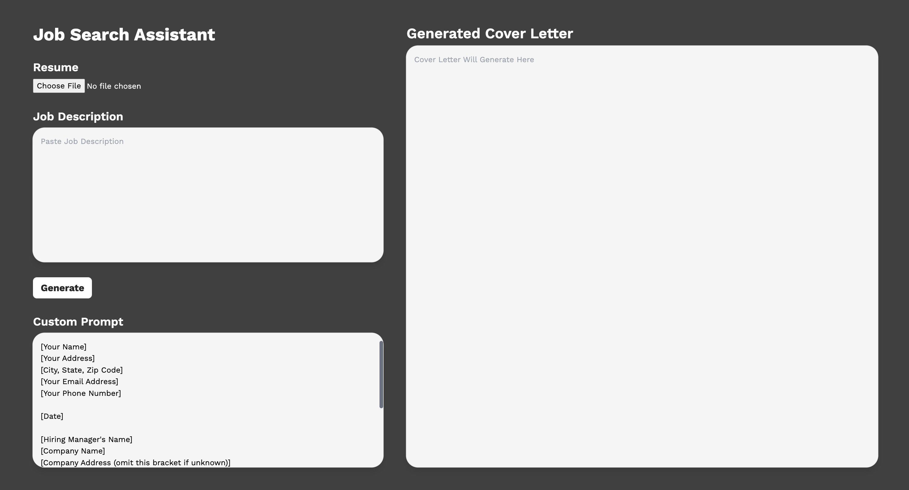

# Job Search Assistant

Job Search Assistant is a web application designed to help users generate tailored cover letters for job applications. The app allows users to upload their resumes (in PDF, DOCX, or TXT formats) and paste the job description. Based on this input, the app generates a personalized cover letter using AI-powered language models.



## Features

- Upload a resume in PDF, DOCX, or TXT format.
- Paste the job description directly into the text area.
- Customize the cover letter template.
- Generate a cover letter tailored to the job description and resume.
- Responsive and user-friendly design.

## Technologies Used

- **Frontend:**
  - Angular
  - Tailwind CSS
  - TypeScript

- **Backend:**
  - Node.js
  - Express.js
  - Multer (for file uploads)
  - Google Gemini AI (AI-powered content generation)
  - PDF-Parse (for parsing PDFs)
  - Mammoth (for handling DOCX files)

- **Deployment:**
  - Localhost for development
  - Hosted on your server (you can mention deployment instructions if hosted somewhere)

## Installation

### Frontend

1. Clone the repository:
```bash
git clone https://github.com/your-username/job-search-assist.git
cd job-search-assist/frontend
```

2. Install the required dependencies:
```bash
npm 
```

3. Run the frontend
```bash
ng serve
```

### Backend

1.	Navigate to the backend directory:
```bash
cd job-search-assist/backend
```

2.	Install the required dependencies:
```bash
npm install
```

3.	Set up your .env file with your Google Gemini API key:
```bash
GEMINI_API_KEY=your_api_key_here
```

4.	Run the backend server:
```bash
node index.js
```

5.	The backend will be running on http://localhost:5687.

## Usage
1.	Open the frontend application in your browser (usually at http://localhost:4200).
2.	Upload your resume in PDF, DOCX, or TXT format.
3.	Paste the job description in the provided textarea.
4.	Optionally, customize the cover letter template.
5.	Click the “Generate” button to receive your tailored cover letter.

## Contributing

We welcome contributions! If you’d like to improve the project or add new features, please follow these steps:
1.	Fork the repository.
2.	Create a new branch (git checkout -b feature/your-feature).
3.	Make your changes.
4.	Commit your changes (git commit -am 'Add a feature').
5.	Push to the branch (git push origin feature/your-feature).
6.	Create a new Pull Request.
